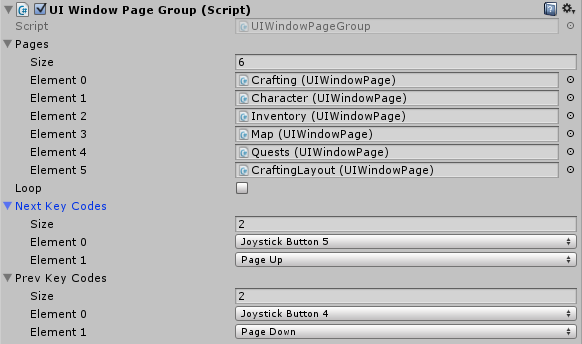
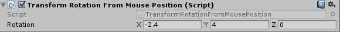
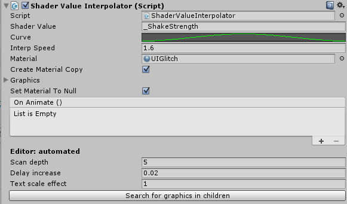

# Getting Started

All demo scenes can be found at "InventoryProSciFiDesign/FirstVersion/Demos/". All Designs can be found at "InventoryProSciFiDesign/Designs".

Like Inventory pro, all UI elements are separated into little pieces, prefabs. These prefabs can be replaced and modified to completely change the UI layout, style and colors.

## UIPageGroup

The UIPageGroup can be used to set up a group of pages that you'd like to navigate between. This is used for the primary menu, which includes the inventory, character, map, quest and crafting pages. The next and prev key codes can be modified to change the key combinations required to move between windows. Additionally you can also show any page in the group, which will hide the other windows and focus on it.

## Layout changer

The layout changer is used to change the layout on the inventory, and at the same time move the inventory wrappers between windows. This can be configured in the "Copy to containers" element.

Each window that requires the inventory to be shown (for example, vendor, bank, character window), needs it's collection and window referenced in the "Copy to containers" to auto. copy the inventory back and forth. Additionally the default configurations for the layout group can be set up.

## Use wrapper on key

Use wrapper on key is a helper component that triggers the item's Use() on whichever wrapper is currently selected. This can be useful to add global actions to your game.

## Transform rotation from mouse position

The transform rotation from mouse position rotates the transform around the cursor; This creates an extra element of depth on the UI. The rotation amount can be tweaked by setting the "rotation" vector in the editor.

## Shader value interpolator

The shader value interpolator is generally used for the glitch effect. This script sets the "_ShakeStrength" (glitch effect amount) on the materials to animate them in and out. Using the helpful little editor at the bottom you can scan for all the graphical elements in the children. These are then stored in the "Graphics" field, so they can be used to animate later.

