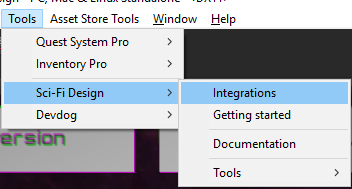
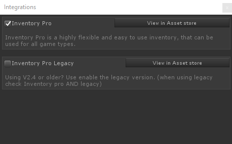

# Inventory Pro Integration

To enable the Inventory Pro integration you'll, have to go `Tools / Sci-Fi Design / Integrations` (see image below)

Next, check the Inventory Pro checkbox. If you're using an older version of Inventory Pro (2.4 or older)  **also** check Inventory Pro Legacy. If you're using Inventory Pro V2.5+ the legacy integration should be left unchecked.

